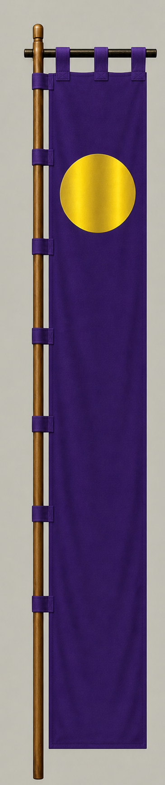

# 伊達政宗

[English version](../../en/commanders/eastern/date-masamune.md)

{ .wiki-image width="25%" }

伊達政宗隊の旗印

## ゲーム内データ

| 項目 | 値 |
|---|---:|
| 軍 | 東軍 |
| 区分 | 架空拡張マップ追加武将 |
| 兵数 | 17,000 |
| 開始士気 | 105 |
| 攻撃 | 86 |
| 防御 | 76 |
| 積極性 | 88 |
| 忠誠 | 76 |
| 躊躇 | 14 |
| 統率 | 80 |
| 指揮信頼 | 84 |

## ゲーム内での特徴

大兵力の部隊で、積極性88と攻撃86が目立ちます。開始士気は105、躊躇は14です。

!!! note
    能力値は固定能力シナリオの値です。ランダム能力シナリオでは変化します。また、ゲーム内能力は史実上の人物評価そのものではありません。

## 簡単な経歴

奥州の戦国大名で、若くして伊達家を継ぎ南奥羽へ勢力を拡大した。豊臣政権に服属し、関ヶ原期には東軍側として上杉勢を牽制した。

## 人となり

独眼竜の異名で知られ、野心、外交力、文化的関心を併せ持つ。大胆さと慎重な情勢判断を使い分けた人物とされる。

## 史実とゲーム表現

このページでは、史実上の略歴・人物像と、ゲーム内の能力値を分けて記載しています。人物像については後世の逸話や評価が混在するため、断定的な性格診断ではなく、一般的な歴史評価としてまとめています。
