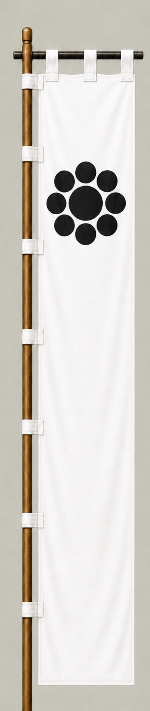

# 細川忠興

[English version](../../en/commanders/eastern/hosokawa-tadaoki.md)

{ .wiki-image }

細川忠興隊の旗印

## ゲーム内データ

| 項目 | 値 |
|---|---:|
| 軍 | 東軍 |
| 区分 | 関ヶ原基本武将 |
| 兵数 | 5,000 |
| 開始士気 | 103 |
| 攻撃 | 78 |
| 防御 | 76 |
| 積極性 | 74 |
| 忠誠 | 84 |
| 躊躇 | 18 |
| 統率 | 82 |
| 指揮信頼 | 80 |

## ゲーム内での特徴

中規模の部隊で、忠誠84と統率82が目立ちます。開始士気は103、躊躇は18です。

!!! note
    能力値は固定能力シナリオの値です。ランダム能力シナリオでは変化します。また、ゲーム内能力は史実上の人物評価そのものではありません。

## 簡単な経歴

細川藤孝の嫡男で、織田・豊臣政権に仕えた。関ヶ原では東軍に属し、石田三成隊方面で戦った。戦後は豊前小倉藩を領した。

## 人となり

武勇と教養を併せ持ち、茶人としても知られる。一方で激しい気性を示す逸話もあり、政治的判断と個人的感情の強さをあわせ持つ人物像が伝わる。

## 史実とゲーム表現

このページでは、史実上の略歴・人物像と、ゲーム内の能力値を分けて記載しています。人物像については後世の逸話や評価が混在するため、断定的な性格診断ではなく、一般的な歴史評価としてまとめています。
