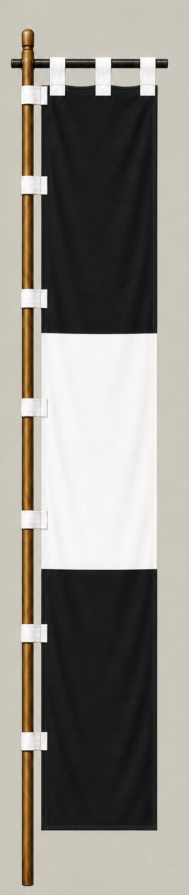

# 黒田長政

[English version](../../en/commanders/eastern/kuroda-nagamasa.md)

{ .wiki-image }

黒田長政隊の旗印

## ゲーム内データ

| 項目 | 値 |
|---|---:|
| 軍 | 東軍 |
| 区分 | 関ヶ原基本武将 |
| 兵数 | 5,400 |
| 開始士気 | 102 |
| 攻撃 | 76 |
| 防御 | 74 |
| 積極性 | 72 |
| 忠誠 | 82 |
| 躊躇 | 22 |
| 統率 | 80 |
| 指揮信頼 | 84 |

## ゲーム内での特徴

中規模の部隊で、指揮信頼84と忠誠82が目立ちます。開始士気は102、躊躇は22です。

!!! note
    能力値は固定能力シナリオの値です。ランダム能力シナリオでは変化します。また、ゲーム内能力は史実上の人物評価そのものではありません。

## 簡単な経歴

黒田官兵衛の嫡男。豊臣政権下で各地を転戦し、関ヶ原では東軍として戦う一方、事前の調略にも深く関わった。戦後は筑前福岡藩の基礎を築いた。

## 人となり

父譲りの調略力と実務能力を備えた武将とされる。正面戦闘だけでなく、諸将との交渉や寝返り工作で戦局形成に寄与した。

## 史実とゲーム表現

このページでは、史実上の略歴・人物像と、ゲーム内の能力値を分けて記載しています。人物像については後世の逸話や評価が混在するため、断定的な性格診断ではなく、一般的な歴史評価としてまとめています。
