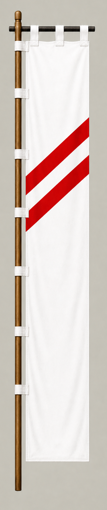

# 赤座直保

[English version](../../en/commanders/western/akaza-naoyasu.md)

{ .wiki-image }

赤座直保隊の旗印

## ゲーム内データ

| 項目 | 値 |
|---|---:|
| 軍 | 西軍 |
| 区分 | 関ヶ原基本武将 |
| 兵数 | 600 |
| 開始士気 | 89 |
| 攻撃 | 52 |
| 防御 | 50 |
| 積極性 | 30 |
| 忠誠 | 36 |
| 躊躇 | 78 |
| 統率 | 46 |
| 指揮信頼 | 34 |

## ゲーム内での特徴

小規模の部隊で、攻撃52と防御50が目立ちます。開始士気は89、躊躇は78です。

!!! note
    能力値は固定能力シナリオの値です。ランダム能力シナリオでは変化します。また、ゲーム内能力は史実上の人物評価そのものではありません。

## 簡単な経歴

豊臣政権下の武将。関ヶ原では西軍側に布陣したが、戦中に東軍へ転じた諸将の一人とされる。

## 人となり

詳しい人物像を示す史料は限られる。関ヶ原後は前田家に仕えたとされ、政変を生き延びた武将である。

## 史実とゲーム表現

このページでは、史実上の略歴・人物像と、ゲーム内の能力値を分けて記載しています。人物像については後世の逸話や評価が混在するため、断定的な性格診断ではなく、一般的な歴史評価としてまとめています。
