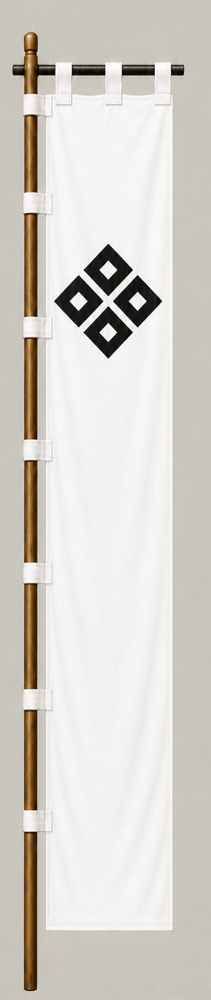

# 朽木元綱

[English version](../../en/commanders/western/kutsuki-mototsuna.md)

{ .wiki-image }

朽木元綱隊の旗印

## ゲーム内データ

| 項目 | 値 |
|---|---:|
| 軍 | 西軍 |
| 区分 | 関ヶ原基本武将 |
| 兵数 | 600 |
| 開始士気 | 89 |
| 攻撃 | 52 |
| 防御 | 52 |
| 積極性 | 28 |
| 忠誠 | 38 |
| 躊躇 | 78 |
| 統率 | 48 |
| 指揮信頼 | 34 |

## ゲーム内での特徴

小規模の部隊で、攻撃52と防御52が目立ちます。開始士気は89、躊躇は78です。

!!! note
    能力値は固定能力シナリオの値です。ランダム能力シナリオでは変化します。また、ゲーム内能力は史実上の人物評価そのものではありません。

## 簡単な経歴

近江朽木谷の領主で、織田・豊臣政権に仕えた。関ヶ原では西軍側にいたが、戦中に東軍へ転じた諸将の一人とされる。

## 人となり

近江の交通上重要な土地を守り、政権交代を生き抜いた地方領主。家の存続を重視する慎重な判断が特徴といえる。

## 史実とゲーム表現

このページでは、史実上の略歴・人物像と、ゲーム内の能力値を分けて記載しています。人物像については後世の逸話や評価が混在するため、断定的な性格診断ではなく、一般的な歴史評価としてまとめています。
