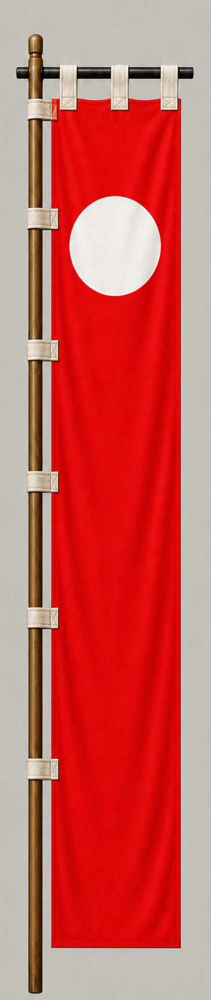

# 毛利秀元

[English version](../../en/commanders/western/mori-hidemoto.md)

{ .wiki-image width="25%" }

毛利秀元隊の旗印

## ゲーム内データ

| 項目 | 値 |
|---|---:|
| 軍 | 西軍 |
| 区分 | 関ヶ原基本武将 |
| 兵数 | 15,000 |
| 開始士気 | 101 |
| 攻撃 | 72 |
| 防御 | 76 |
| 積極性 | 22 |
| 忠誠 | 78 |
| 躊躇 | 72 |
| 統率 | 80 |
| 指揮信頼 | 42 |

## ゲーム内での特徴

大兵力の部隊で、統率80と忠誠78が目立ちます。開始士気は101、躊躇は72です。

!!! note
    能力値は固定能力シナリオの値です。ランダム能力シナリオでは変化します。また、ゲーム内能力は史実上の人物評価そのものではありません。

## 簡単な経歴

毛利元就の孫で、毛利氏の有力一門。関ヶ原では西軍の大軍を率いて南宮山に布陣したが、前方の吉川広家隊が動かなかったため本格参戦できなかった。

## 人となり

大軍を預かる立場にありながら行動を制約された武将である。後に長府藩の祖となり、毛利一門の有力者として活動した。

## 史実とゲーム表現

このページでは、史実上の略歴・人物像と、ゲーム内の能力値を分けて記載しています。人物像については後世の逸話や評価が混在するため、断定的な性格診断ではなく、一般的な歴史評価としてまとめています。
