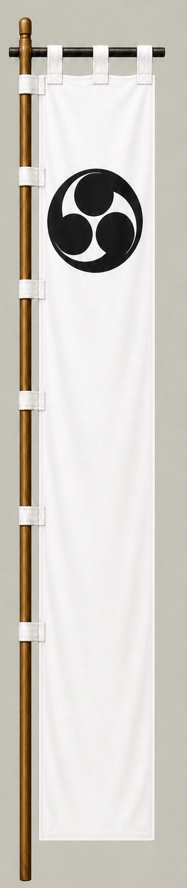

# 小川祐忠

[English version](../../en/commanders/western/ogawa-suketada.md)

{ .wiki-image width="25%" }

小川祐忠隊の旗印

## ゲーム内データ

| 項目 | 値 |
|---|---:|
| 軍 | 西軍 |
| 区分 | 関ヶ原基本武将 |
| 兵数 | 2,100 |
| 開始士気 | 90 |
| 攻撃 | 56 |
| 防御 | 55 |
| 積極性 | 32 |
| 忠誠 | 38 |
| 躊躇 | 76 |
| 統率 | 50 |
| 指揮信頼 | 36 |

## ゲーム内での特徴

中規模の部隊で、攻撃56と防御55が目立ちます。開始士気は90、躊躇は76です。

!!! note
    能力値は固定能力シナリオの値です。ランダム能力シナリオでは変化します。また、ゲーム内能力は史実上の人物評価そのものではありません。

## 簡単な経歴

豊臣政権下で大名となり、関ヶ原では西軍側に配置された。戦中に東軍へ転じ、大谷吉継隊方面の戦闘に加わった。

## 人となり

関ヶ原での転身で知られるが、戦後に所領を失っており、行動が必ずしも安泰につながらなかった例でもある。

## 史実とゲーム表現

このページでは、史実上の略歴・人物像と、ゲーム内の能力値を分けて記載しています。人物像については後世の逸話や評価が混在するため、断定的な性格診断ではなく、一般的な歴史評価としてまとめています。
