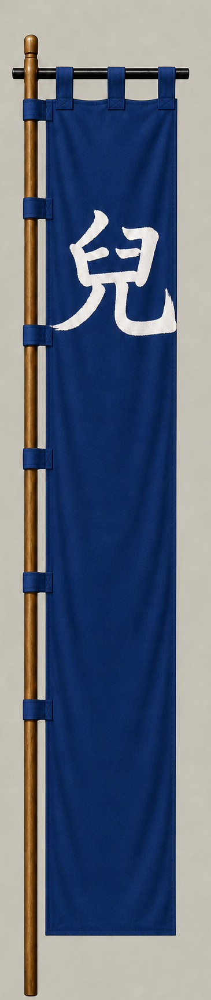

# 宇喜多秀家

[English version](../../en/commanders/western/ukita-hideie.md)

{ .wiki-image }

宇喜多秀家隊の旗印

## ゲーム内データ

| 項目 | 値 |
|---|---:|
| 軍 | 西軍 |
| 区分 | 関ヶ原基本武将 |
| 兵数 | 17,000 |
| 開始士気 | 104 |
| 攻撃 | 82 |
| 防御 | 82 |
| 積極性 | 78 |
| 忠誠 | 86 |
| 躊躇 | 16 |
| 統率 | 78 |
| 指揮信頼 | 82 |

## ゲーム内での特徴

大兵力の部隊で、忠誠86と攻撃82が目立ちます。開始士気は104、躊躇は16です。

!!! note
    能力値は固定能力シナリオの値です。ランダム能力シナリオでは変化します。また、ゲーム内能力は史実上の人物評価そのものではありません。

## 簡単な経歴

備前の大大名宇喜多直家の子で、豊臣秀吉の養女婿となり五大老に列した。関ヶ原では西軍最大級の主力を率い、福島正則隊と激戦を展開した。

## 人となり

若くして大領を継ぎ、豊臣政権の中核に位置した。関ヶ原後は八丈島へ流され、長い流刑生活を送った。

## 史実とゲーム表現

このページでは、史実上の略歴・人物像と、ゲーム内の能力値を分けて記載しています。人物像については後世の逸話や評価が混在するため、断定的な性格診断ではなく、一般的な歴史評価としてまとめています。
