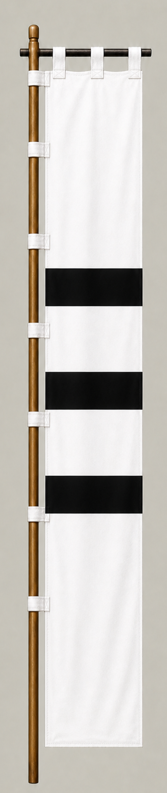

# Asano Yoshinaga

[日本語版](../../../commanders/eastern/asano-yoshinaga.md)

  
  
Unit banner

  <h2>In-Game Data</h2>
<table>
  <thead>
    <tr><th>Attribute</th><th>Value</th></tr>
  </thead>
  <tbody>
    <tr><td>Army</td><td>Eastern Army</td></tr>
    <tr><td>Category</td><td>Additional commander for the fictional expanded map</td></tr>
    <tr><td>Troops</td><td>6,500</td></tr>
    <tr><td>Starting morale</td><td>99</td></tr>
    <tr><td>Attack</td><td>70</td></tr>
    <tr><td>Defense</td><td>70</td></tr>
    <tr><td>Aggressiveness</td><td>64</td></tr>
    <tr><td>Loyalty</td><td>80</td></tr>
    <tr><td>Hesitation</td><td>28</td></tr>
    <tr><td>Leadership</td><td>72</td></tr>
    <tr><td>Command confidence</td><td>74</td></tr>
  </tbody>
</table>

## In-Game Characteristics

This is a medium-sized unit, with particularly high loyalty (80) and command confidence (74). Starting morale is 99, while hesitation is 28.

!!! note
    These are fixed values used outside the random-ability scenario. In-game statistics are not intended as a direct historical judgment of the individual.

## Brief Career

The eldest son of Asano Nagamasa. He served in the Korean campaigns and fought for the Eastern Army at Sekigahara, later receiving Kii.

## Character and Reputation

A pragmatic daimyo who combined military service with a realistic decision to support the Tokugawa side.

## History and Game Representation

Historical background and in-game statistics are presented separately. Character descriptions summarize common historical interpretations rather than offering definitive personality diagnoses.
