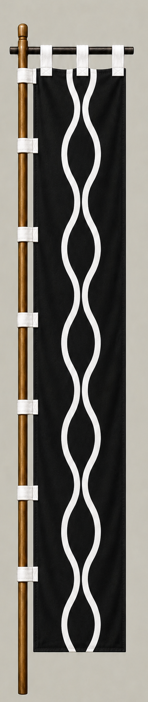

# Fukushima Masanori

[日本語版](../../../commanders/eastern/fukushima-masanori.md)

{ .wiki-image width="25%" }

Unit banner

## In-Game Data

| Attribute | Value |
|---|---:|
| Army | Eastern Army |
| Category | Core Sekigahara commander |
| Troops | 6,000 |
| Starting morale | 104 |
| Attack | 88 |
| Defense | 66 |
| Aggressiveness | 92 |
| Loyalty | 86 |
| Hesitation | 10 |
| Leadership | 68 |
| Command confidence | 72 |

## In-Game Characteristics

This is a medium-sized unit, with particularly high aggressiveness (92) and attack (88). Starting morale is 104, while hesitation is 10.

!!! note
    These are fixed values used outside the random-ability scenario. In-game statistics are not intended as a direct historical judgment of the individual.

## Brief Career

A close retainer of Toyotomi Hideyoshi, he won fame in the Battle of Shizugatake and later ruled Kiyosu. At Sekigahara he fought in the Eastern Army's front line against forces including Ukita Hideie's.

## Character and Reputation

He is often remembered as a direct and exceptionally brave warrior. Stories also emphasize a hot temper, but he played an important role in rallying Toyotomi-associated lords to the Eastern side.

## History and Game Representation

Historical background and in-game statistics are presented separately. Character descriptions summarize common historical interpretations rather than offering definitive personality diagnoses.
