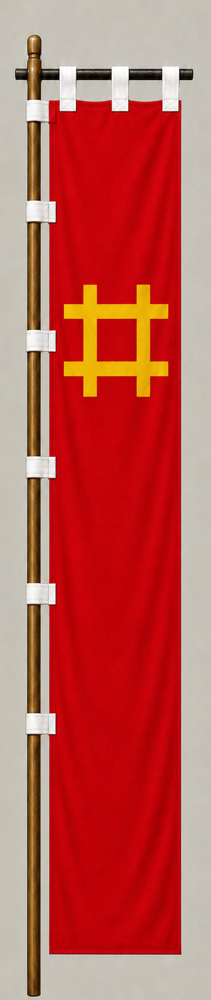

# Ii Naomasa

[日本語版](../../../commanders/eastern/ii-naomasa.md)

  
  
Unit banner

  <h2>In-Game Data</h2>
<table>
  <thead>
    <tr><th>Attribute</th><th>Value</th></tr>
  </thead>
  <tbody>
    <tr><td>Army</td><td>Eastern Army</td></tr>
    <tr><td>Category</td><td>Core Sekigahara commander</td></tr>
    <tr><td>Troops</td><td>3,600</td></tr>
    <tr><td>Starting morale</td><td>105</td></tr>
    <tr><td>Attack</td><td>90</td></tr>
    <tr><td>Defense</td><td>68</td></tr>
    <tr><td>Aggressiveness</td><td>94</td></tr>
    <tr><td>Loyalty</td><td>92</td></tr>
    <tr><td>Hesitation</td><td>8</td></tr>
    <tr><td>Leadership</td><td>76</td></tr>
    <tr><td>Command confidence</td><td>82</td></tr>
  </tbody>
</table>

## In-Game Characteristics

This is a medium-sized unit, with particularly high aggressiveness (94) and loyalty (92). Starting morale is 105, while hesitation is 8.

!!! note
    These are fixed values used outside the random-ability scenario. In-game statistics are not intended as a direct historical judgment of the individual.

## Brief Career

One of the Four Heavenly Kings of Tokugawa. He commanded the famous Red Devils, helped open the battle at Sekigahara, and was wounded during the pursuit of the Shimazu force.

## Character and Reputation

He was known for strict discipline, aggressive tactics, and the striking red-armored corps under his command. He also showed ability in diplomacy and administration.

## History and Game Representation

Historical background and in-game statistics are presented separately. Character descriptions summarize common historical interpretations rather than offering definitive personality diagnoses.
