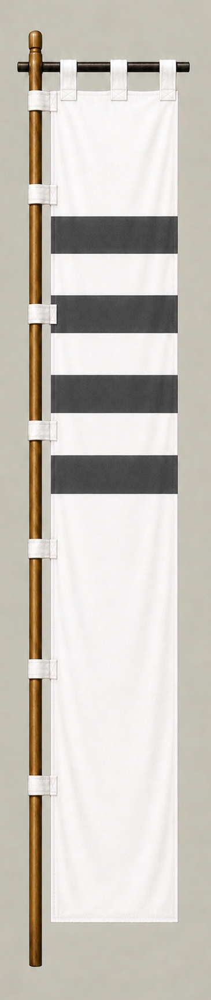

# Ikeda Terumasa

[日本語版](../../../commanders/eastern/ikeda-terumasa.md)

{ .wiki-image }

Unit banner

## In-Game Data

| Attribute | Value |
|---|---:|
| Army | Eastern Army |
| Category | Additional commander for the fictional expanded map |
| Troops | 4,500 |
| Starting morale | 98 |
| Attack | 68 |
| Defense | 72 |
| Aggressiveness | 56 |
| Loyalty | 82 |
| Hesitation | 32 |
| Leadership | 74 |
| Command confidence | 76 |

## In-Game Characteristics

This is a medium-sized unit, with particularly high loyalty (82) and command confidence (76). Starting morale is 98, while hesitation is 32.

!!! note
    These are fixed values used outside the random-ability scenario. In-game statistics are not intended as a direct historical judgment of the individual.

## Brief Career

The son of Oda retainer Ikeda Tsuneoki. He fought for the Eastern Army at Sekigahara and later became a major western daimyo based at Himeji.

## Character and Reputation

A politically well-connected and capable regional ruler, best remembered for the major rebuilding of Himeji Castle.

## History and Game Representation

Historical background and in-game statistics are presented separately. Character descriptions summarize common historical interpretations rather than offering definitive personality diagnoses.
