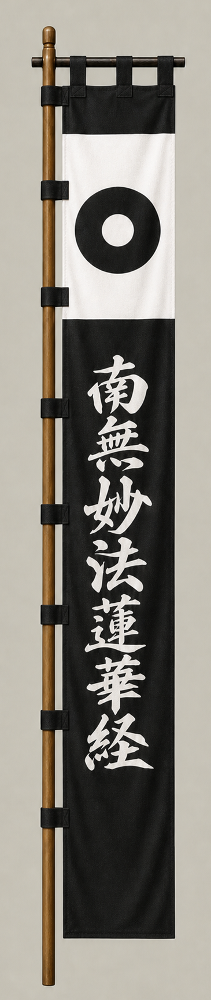

# Kato Kiyomasa

[日本語版](../../../commanders/eastern/kato-kiyomasa.md)

  
  
Unit banner

  <h2>In-Game Data</h2>
<table>
  <thead>
    <tr><th>Attribute</th><th>Value</th></tr>
  </thead>
  <tbody>
    <tr><td>Army</td><td>Eastern Army</td></tr>
    <tr><td>Category</td><td>Additional commander for the fictional expanded map</td></tr>
    <tr><td>Troops</td><td>10,000</td></tr>
    <tr><td>Starting morale</td><td>107</td></tr>
    <tr><td>Attack</td><td>92</td></tr>
    <tr><td>Defense</td><td>78</td></tr>
    <tr><td>Aggressiveness</td><td>92</td></tr>
    <tr><td>Loyalty</td><td>88</td></tr>
    <tr><td>Hesitation</td><td>8</td></tr>
    <tr><td>Leadership</td><td>78</td></tr>
    <tr><td>Command confidence</td><td>80</td></tr>
  </tbody>
</table>

## In-Game Characteristics

This is a medium-sized unit, with particularly high attack (92) and aggressiveness (92). Starting morale is 107, while hesitation is 8.

!!! note
    These are fixed values used outside the random-ability scenario. In-game statistics are not intended as a direct historical judgment of the individual.

## Brief Career

A close retainer of Toyotomi Hideyoshi, famous for combat in Korea and for castle building. He did not fight in the main Sekigahara battle but acted for the Eastern side in Kyushu.

## Character and Reputation

Remembered as a fierce warrior, master castle builder, and capable administrator with strong practical skills.

## History and Game Representation

Historical background and in-game statistics are presented separately. Character descriptions summarize common historical interpretations rather than offering definitive personality diagnoses.
