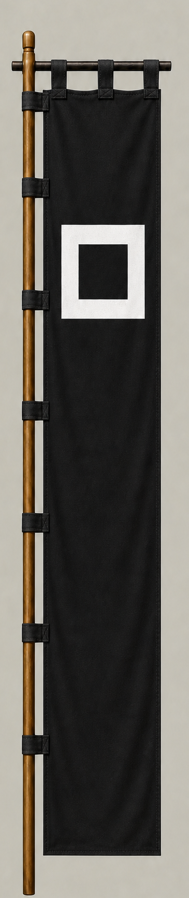

# Kyogoku Takatomo

[日本語版](../../../commanders/eastern/kyogoku-takatomo.md)

  
  
Unit banner

  <h2>In-Game Data</h2>
<table>
  <thead>
    <tr><th>Attribute</th><th>Value</th></tr>
  </thead>
  <tbody>
    <tr><td>Army</td><td>Eastern Army</td></tr>
    <tr><td>Category</td><td>Core Sekigahara commander</td></tr>
    <tr><td>Troops</td><td>3,000</td></tr>
    <tr><td>Starting morale</td><td>97</td></tr>
    <tr><td>Attack</td><td>64</td></tr>
    <tr><td>Defense</td><td>68</td></tr>
    <tr><td>Aggressiveness</td><td>54</td></tr>
    <tr><td>Loyalty</td><td>78</td></tr>
    <tr><td>Hesitation</td><td>36</td></tr>
    <tr><td>Leadership</td><td>70</td></tr>
    <tr><td>Command confidence</td><td>72</td></tr>
  </tbody>
</table>

## In-Game Characteristics

This is a medium-sized unit, with particularly high loyalty (78) and command confidence (72). Starting morale is 97, while hesitation is 36.

!!! note
    These are fixed values used outside the random-ability scenario. In-game statistics are not intended as a direct historical judgment of the individual.

## Brief Career

A member of the prestigious Kyogoku family of Omi. He served the Toyotomi government, joined the Eastern Army at Sekigahara, and received Tango after the battle.

## Character and Reputation

More a survivor and organizer than a flamboyant battlefield hero, he preserved his house through major changes of regime.

## History and Game Representation

Historical background and in-game statistics are presented separately. Character descriptions summarize common historical interpretations rather than offering definitive personality diagnoses.
