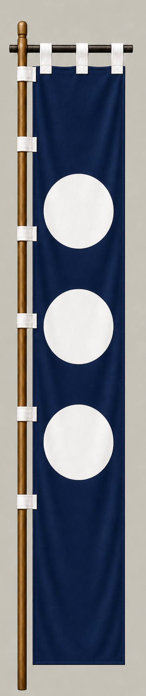

# Todo Takatora

[日本語版](../../../commanders/eastern/todo-takatora.md)

{ .wiki-image }

Unit banner

## In-Game Data

| Attribute | Value |
|---|---:|
| Army | Eastern Army |
| Category | Core Sekigahara commander |
| Troops | 2,500 |
| Starting morale | 101 |
| Attack | 72 |
| Defense | 74 |
| Aggressiveness | 68 |
| Loyalty | 76 |
| Hesitation | 28 |
| Leadership | 78 |
| Command confidence | 86 |

## In-Game Characteristics

This is a medium-sized unit, with particularly high command confidence (86) and leadership (78). Starting morale is 101, while hesitation is 28.

!!! note
    These are fixed values used outside the random-ability scenario. In-game statistics are not intended as a direct historical judgment of the individual.

## Brief Career

After serving several lords, he rose under Toyotomi Hidenaga and Hideyoshi. He fought for the Eastern Army at Sekigahara and later became lord of Tsu.

## Character and Reputation

A practical and adaptable commander who rose through ability rather than inheritance. He was especially respected for castle design, logistics, and political judgment.

## History and Game Representation

Historical background and in-game statistics are presented separately. Character descriptions summarize common historical interpretations rather than offering definitive personality diagnoses.
