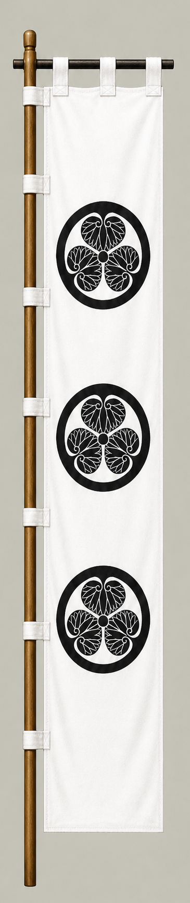

# Tokugawa Ieyasu

[日本語版](../../../commanders/eastern/tokugawa-ieyasu.md)

{ .wiki-image width="25%" }

Unit banner

## In-Game Data

| Attribute | Value |
|---|---:|
| Army | Eastern Army |
| Category | Core Sekigahara commander |
| Troops | 30,000 |
| Starting morale | 108 |
| Attack | 74 |
| Defense | 92 |
| Aggressiveness | 62 |
| Loyalty | 100 |
| Hesitation | 16 |
| Leadership | 94 |
| Command confidence | 98 |

## In-Game Characteristics

This is a large unit, with particularly high loyalty (100) and command confidence (98). Starting morale is 108, while hesitation is 16.

!!! note
    These are fixed values used outside the random-ability scenario. In-game statistics are not intended as a direct historical judgment of the individual.

## Brief Career

Born into the Matsudaira family of Mikawa, he expanded his power through alliances and warfare before becoming one of the leading elders of the Toyotomi government. He led the Eastern Army at Sekigahara and later established the Tokugawa shogunate.

## Character and Reputation

He is commonly portrayed as patient, cautious, and highly pragmatic, yet capable of bold action once he judged the moment favorable. He excelled at long-term political organization and control of retainers.

## History and Game Representation

Historical background and in-game statistics are presented separately. Character descriptions summarize common historical interpretations rather than offering definitive personality diagnoses.
