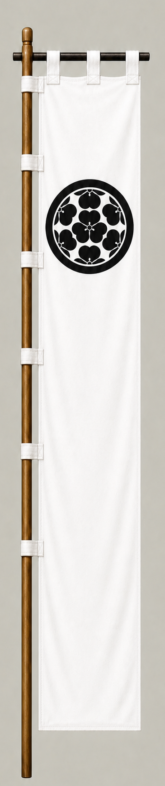

# Chosokabe Morichika

[日本語版](../../../commanders/western/chosokabe-morichika.md)

  
  
Unit banner

  <h2>In-Game Data</h2>
<table>
  <thead>
    <tr><th>Attribute</th><th>Value</th></tr>
  </thead>
  <tbody>
    <tr><td>Army</td><td>Western Army</td></tr>
    <tr><td>Category</td><td>Additional commander for the fictional expanded map</td></tr>
    <tr><td>Troops</td><td>6,600</td></tr>
    <tr><td>Starting morale</td><td>97</td></tr>
    <tr><td>Attack</td><td>68</td></tr>
    <tr><td>Defense</td><td>68</td></tr>
    <tr><td>Aggressiveness</td><td>54</td></tr>
    <tr><td>Loyalty</td><td>74</td></tr>
    <tr><td>Hesitation</td><td>40</td></tr>
    <tr><td>Leadership</td><td>72</td></tr>
    <tr><td>Command confidence</td><td>64</td></tr>
  </tbody>
</table>

## In-Game Characteristics

This is a medium-sized unit, with particularly high loyalty (74) and leadership (72). Starting morale is 97, while hesitation is 40.

!!! note
    These are fixed values used outside the random-ability scenario. In-game statistics are not intended as a direct historical judgment of the individual.

## Brief Career

The son of Chosokabe Motochika and ruler of Tosa. He deployed with the Western Army near Mount Nangu but did not enter the main battle, and later fought for the Toyotomi side at Osaka.

## Character and Reputation

A young successor who lost his domain during the regime change and later sought restoration through the Osaka campaigns.

## History and Game Representation

Historical background and in-game statistics are presented separately. Character descriptions summarize common historical interpretations rather than offering definitive personality diagnoses.
