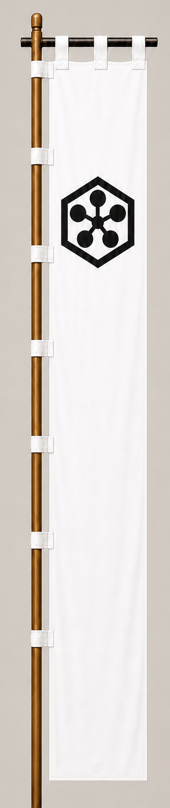

# Hiratsuka Tamehiro

[日本語版](../../../commanders/western/hiratsuka-tamehiro.md)

  
  
Unit banner

  <h2>In-Game Data</h2>
<table>
  <thead>
    <tr><th>Attribute</th><th>Value</th></tr>
  </thead>
  <tbody>
    <tr><td>Army</td><td>Western Army</td></tr>
    <tr><td>Category</td><td>Core Sekigahara commander</td></tr>
    <tr><td>Troops</td><td>1,500</td></tr>
    <tr><td>Starting morale</td><td>105</td></tr>
    <tr><td>Attack</td><td>84</td></tr>
    <tr><td>Defense</td><td>78</td></tr>
    <tr><td>Aggressiveness</td><td>80</td></tr>
    <tr><td>Loyalty</td><td>96</td></tr>
    <tr><td>Hesitation</td><td>12</td></tr>
    <tr><td>Leadership</td><td>82</td></tr>
    <tr><td>Command confidence</td><td>80</td></tr>
  </tbody>
</table>

## In-Game Characteristics

This is a medium-sized unit, with particularly high loyalty (96) and attack (84). Starting morale is 105, while hesitation is 12.

!!! note
    These are fixed values used outside the random-ability scenario. In-game statistics are not intended as a direct historical judgment of the individual.

## Brief Career

A Toyotomi commander who fought alongside Otani Yoshitsugu at Sekigahara. He resisted the attackers on the Western right wing and was killed in battle.

## Character and Reputation

Tradition remembers him for courage and loyalty in a losing battle. His reported death poem further shaped his image as a resolute warrior.

## History and Game Representation

Historical background and in-game statistics are presented separately. Character descriptions summarize common historical interpretations rather than offering definitive personality diagnoses.
