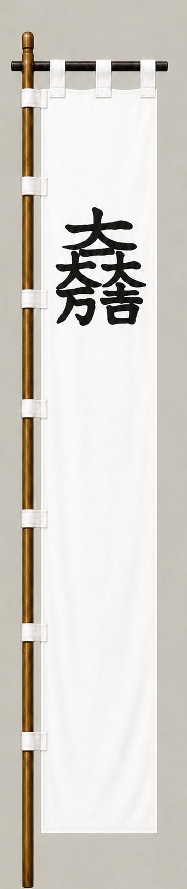

# Ishida Mitsunari

[日本語版](../../../commanders/western/ishida-mitsunari.md)

  
  
Unit banner

  <h2>In-Game Data</h2>
<table>
  <thead>
    <tr><th>Attribute</th><th>Value</th></tr>
  </thead>
  <tbody>
    <tr><td>Army</td><td>Western Army</td></tr>
    <tr><td>Category</td><td>Core Sekigahara commander</td></tr>
    <tr><td>Troops</td><td>6,000</td></tr>
    <tr><td>Starting morale</td><td>101</td></tr>
    <tr><td>Attack</td><td>54</td></tr>
    <tr><td>Defense</td><td>78</td></tr>
    <tr><td>Aggressiveness</td><td>46</td></tr>
    <tr><td>Loyalty</td><td>96</td></tr>
    <tr><td>Hesitation</td><td>34</td></tr>
    <tr><td>Leadership</td><td>82</td></tr>
    <tr><td>Command confidence</td><td>70</td></tr>
  </tbody>
</table>

## In-Game Characteristics

This is a medium-sized unit, with particularly high loyalty (96) and leadership (82). Starting morale is 101, while hesitation is 34.

!!! note
    These are fixed values used outside the random-ability scenario. In-game statistics are not intended as a direct historical judgment of the individual.

## Brief Career

A skilled administrator in Toyotomi Hideyoshi's government and one of the Five Commissioners. After Hideyoshi's death, he became a central organizer of the Western Army against Tokugawa Ieyasu.

## Character and Reputation

He is associated with discipline, administration, and loyalty to the Toyotomi order. Although older portrayals emphasized poor personal relations, modern interpretations often reassess his competence and principles.

## History and Game Representation

Historical background and in-game statistics are presented separately. Character descriptions summarize common historical interpretations rather than offering definitive personality diagnoses.
