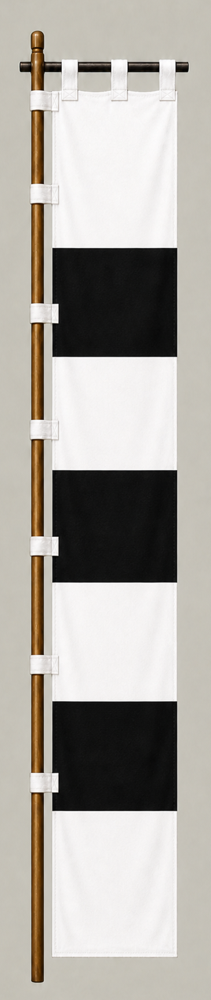

# Kikkawa Hiroie

[日本語版](../../../commanders/western/kikkawa-hiroie.md)

{ .wiki-image width="25%" }

Unit banner

## In-Game Data

| Attribute | Value |
|---|---:|
| Army | Western Army |
| Category | Core Sekigahara commander |
| Troops | 3,000 |
| Starting morale | 95 |
| Attack | 54 |
| Defense | 72 |
| Aggressiveness | 16 |
| Loyalty | 48 |
| Hesitation | 86 |
| Leadership | 76 |
| Command confidence | 30 |

## In-Game Characteristics

This is a medium-sized unit, with particularly high leadership (76) and defense (72). Starting morale is 95, while hesitation is 86.

!!! note
    These are fixed values used outside the random-ability scenario. In-game statistics are not intended as a direct historical judgment of the individual.

## Brief Career

The son of Kikkawa Motoharu and a major Mori-clan leader. Before Sekigahara he negotiated with Tokugawa representatives and prevented the Mori troops on Mount Nangu from advancing.

## Character and Reputation

A cautious political realist who prioritized the survival of the Mori house. His actions remain controversial because they also prevented the Western Army from using a major force.

## History and Game Representation

Historical background and in-game statistics are presented separately. Character descriptions summarize common historical interpretations rather than offering definitive personality diagnoses.
