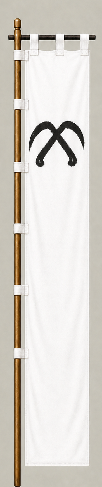

# Kobayakawa Hideaki

[日本語版](../../../commanders/western/kobayakawa-hideaki.md)

  
  
Unit banner

  <h2>In-Game Data</h2>
<table>
  <thead>
    <tr><th>Attribute</th><th>Value</th></tr>
  </thead>
  <tbody>
    <tr><td>Army</td><td>Western Army</td></tr>
    <tr><td>Category</td><td>Core Sekigahara commander</td></tr>
    <tr><td>Troops</td><td>15,000</td></tr>
    <tr><td>Starting morale</td><td>86</td></tr>
    <tr><td>Attack</td><td>66</td></tr>
    <tr><td>Defense</td><td>60</td></tr>
    <tr><td>Aggressiveness</td><td>24</td></tr>
    <tr><td>Loyalty</td><td>32</td></tr>
    <tr><td>Hesitation</td><td>88</td></tr>
    <tr><td>Leadership</td><td>48</td></tr>
    <tr><td>Command confidence</td><td>32</td></tr>
  </tbody>
</table>

## In-Game Characteristics

This is a large unit, with particularly high attack (66) and defense (60). Starting morale is 86, while hesitation is 88.

!!! note
    These are fixed values used outside the random-ability scenario. In-game statistics are not intended as a direct historical judgment of the individual.

## Brief Career

A relative of Toyotomi Hideyoshi who inherited the Kobayakawa house. He initially deployed with the Western Army but changed sides during the battle and attacked Otani Yoshitsugu's forces.

## Character and Reputation

A young lord under intense political pressure. Later tradition reduced him to a symbol of betrayal, but the motives and timing of his decision remain debated.

## History and Game Representation

Historical background and in-game statistics are presented separately. Character descriptions summarize common historical interpretations rather than offering definitive personality diagnoses.
