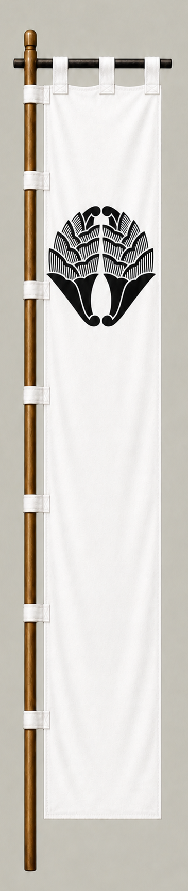

# Nabeshima Naoshige

[日本語版](../../../commanders/western/nabeshima-naoshige.md)

  
  
Unit banner

  <h2>In-Game Data</h2>
<table>
  <thead>
    <tr><th>Attribute</th><th>Value</th></tr>
  </thead>
  <tbody>
    <tr><td>Army</td><td>Western Army</td></tr>
    <tr><td>Category</td><td>Additional commander for the fictional expanded map</td></tr>
    <tr><td>Troops</td><td>12,000</td></tr>
    <tr><td>Starting morale</td><td>102</td></tr>
    <tr><td>Attack</td><td>74</td></tr>
    <tr><td>Defense</td><td>82</td></tr>
    <tr><td>Aggressiveness</td><td>58</td></tr>
    <tr><td>Loyalty</td><td>78</td></tr>
    <tr><td>Hesitation</td><td>30</td></tr>
    <tr><td>Leadership</td><td>84</td></tr>
    <tr><td>Command confidence</td><td>84</td></tr>
  </tbody>
</table>

## In-Game Characteristics

This is a medium-sized unit, with particularly high leadership (84) and command confidence (84). Starting morale is 102, while hesitation is 30.

!!! note
    These are fixed values used outside the random-ability scenario. In-game statistics are not intended as a direct historical judgment of the individual.

## Brief Career

A leading retainer of the Ryuzoji who laid the foundations of the Nabeshima house. During the Sekigahara crisis he worked to preserve his family after his son initially moved with the Western side.

## Character and Reputation

A skilled military and political operator who excelled at internal control and timely negotiation, laying the foundations of the Saga domain.

## History and Game Representation

Historical background and in-game statistics are presented separately. Character descriptions summarize common historical interpretations rather than offering definitive personality diagnoses.
