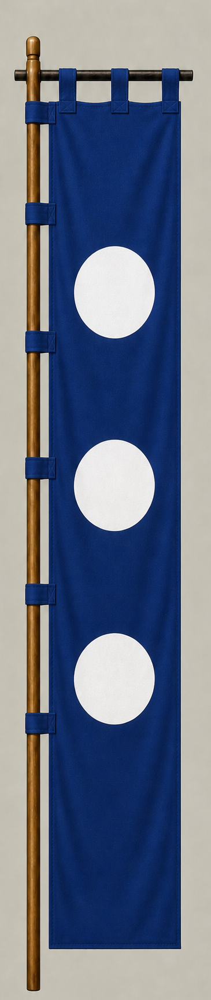

# Otani Yoshitsugu

[日本語版](../../../commanders/western/otani-yoshitsugu.md)

{ .wiki-image width="25%" }

Unit banner

## In-Game Data

| Attribute | Value |
|---|---:|
| Army | Western Army |
| Category | Core Sekigahara commander |
| Troops | 600 |
| Starting morale | 108 |
| Attack | 70 |
| Defense | 92 |
| Aggressiveness | 52 |
| Loyalty | 96 |
| Hesitation | 12 |
| Leadership | 96 |
| Command confidence | 90 |

## In-Game Characteristics

This is a small unit, with particularly high loyalty (96) and leadership (96). Starting morale is 108, while hesitation is 12.

!!! note
    These are fixed values used outside the random-ability scenario. In-game statistics are not intended as a direct historical judgment of the individual.

## Brief Career

A Toyotomi retainer and lord of Tsuruga. He joined Ishida Mitsunari's side at Sekigahara and fought on the Western Army's right wing while watching Kobayakawa Hideaki's position.

## Character and Reputation

Often remembered for loyalty and friendship, he was also an experienced administrator and a calm battlefield commander despite serious illness.

## History and Game Representation

Historical background and in-game statistics are presented separately. Character descriptions summarize common historical interpretations rather than offering definitive personality diagnoses.
