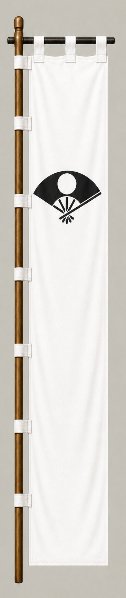

# Satake Yoshinobu

[日本語版](../../../commanders/western/satake-yoshinobu.md)

{ .wiki-image }

Unit banner

## In-Game Data

| Attribute | Value |
|---|---:|
| Army | Western Army |
| Category | Additional commander for the fictional expanded map |
| Troops | 12,000 |
| Starting morale | 98 |
| Attack | 66 |
| Defense | 76 |
| Aggressiveness | 42 |
| Loyalty | 72 |
| Hesitation | 48 |
| Leadership | 80 |
| Command confidence | 68 |

## In-Game Characteristics

This is a medium-sized unit, with particularly high leadership (80) and defense (76). Starting morale is 98, while hesitation is 48.

!!! note
    These are fixed values used outside the random-ability scenario. In-game statistics are not intended as a direct historical judgment of the individual.

## Brief Career

Head of the Satake clan of Hitachi. His ambiguous position during the Sekigahara campaign led to his transfer and reduction to Akita after the war.

## Character and Reputation

An independent-minded lord who hesitated to commit fully to Tokugawa Ieyasu. He later established the foundations of the Akita domain.

## History and Game Representation

Historical background and in-game statistics are presented separately. Character descriptions summarize common historical interpretations rather than offering definitive personality diagnoses.
