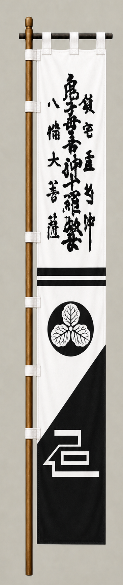

# Shima Sakon

[日本語版](../../../commanders/western/shima-sakon.md)

  
  
Unit banner

  <h2>In-Game Data</h2>
<table>
  <thead>
    <tr><th>Attribute</th><th>Value</th></tr>
  </thead>
  <tbody>
    <tr><td>Army</td><td>Western Army</td></tr>
    <tr><td>Category</td><td>Core Sekigahara commander</td></tr>
    <tr><td>Troops</td><td>1,000</td></tr>
    <tr><td>Starting morale</td><td>107</td></tr>
    <tr><td>Attack</td><td>88</td></tr>
    <tr><td>Defense</td><td>74</td></tr>
    <tr><td>Aggressiveness</td><td>82</td></tr>
    <tr><td>Loyalty</td><td>92</td></tr>
    <tr><td>Hesitation</td><td>10</td></tr>
    <tr><td>Leadership</td><td>82</td></tr>
    <tr><td>Command confidence</td><td>80</td></tr>
  </tbody>
</table>

## In-Game Characteristics

This is a small unit, with particularly high loyalty (92) and attack (88). Starting morale is 107, while hesitation is 10.

!!! note
    These are fixed values used outside the random-ability scenario. In-game statistics are not intended as a direct historical judgment of the individual.

## Brief Career

An experienced warrior who became a senior retainer of Ishida Mitsunari. He fought fiercely below Mount Sasao and is traditionally said to have died at Sekigahara.

## Character and Reputation

Remembered as an experienced and formidable field commander whose reputation was great enough to enhance Mitsunari's own prestige.

## History and Game Representation

Historical background and in-game statistics are presented separately. Character descriptions summarize common historical interpretations rather than offering definitive personality diagnoses.
