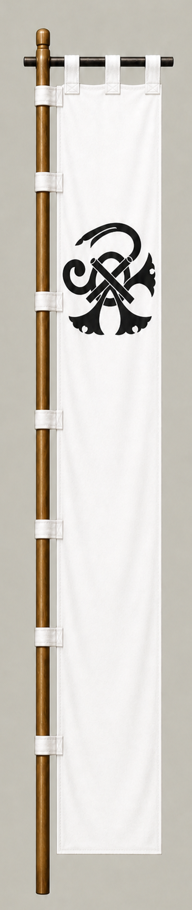

# Tachibana Muneshige

[日本語版](../../../commanders/western/tachibana-muneshige.md)

{ .wiki-image }

Unit banner

## In-Game Data

| Attribute | Value |
|---|---:|
| Army | Western Army |
| Category | Additional commander for the fictional expanded map |
| Troops | 4,000 |
| Starting morale | 109 |
| Attack | 92 |
| Defense | 84 |
| Aggressiveness | 82 |
| Loyalty | 92 |
| Hesitation | 8 |
| Leadership | 90 |
| Command confidence | 88 |

## In-Game Characteristics

This is a medium-sized unit, with particularly high attack (92) and loyalty (92). Starting morale is 109, while hesitation is 8.

!!! note
    These are fixed values used outside the random-ability scenario. In-game statistics are not intended as a direct historical judgment of the individual.

## Brief Career

The son of Takahashi Joun and adopted heir of Tachibana Dosetsu. A highly respected general, he fought for the Western side in the siege of Otsu and later regained his former domain under Tokugawa rule.

## Character and Reputation

Widely respected for courage, command ability, and personal character. His restoration to his former domain under Tokugawa rule was highly unusual.

## History and Game Representation

Historical background and in-game statistics are presented separately. Character descriptions summarize common historical interpretations rather than offering definitive personality diagnoses.
