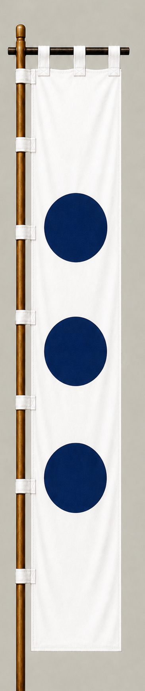

# Toda Shigemasa

[日本語版](../../../commanders/western/toda-shigemasa.md)

{ .wiki-image width="25%" }

Unit banner

## In-Game Data

| Attribute | Value |
|---|---:|
| Army | Western Army |
| Category | Core Sekigahara commander |
| Troops | 1,500 |
| Starting morale | 101 |
| Attack | 72 |
| Defense | 72 |
| Aggressiveness | 66 |
| Loyalty | 92 |
| Hesitation | 20 |
| Leadership | 76 |
| Command confidence | 76 |

## In-Game Characteristics

This is a medium-sized unit, with particularly high loyalty (92) and leadership (76). Starting morale is 101, while hesitation is 20.

!!! note
    These are fixed values used outside the random-ability scenario. In-game statistics are not intended as a direct historical judgment of the individual.

## Brief Career

A Toyotomi-aligned commander who fought with forces associated with Otani Yoshitsugu at Sekigahara. He is believed to have died fighting the troops that attacked the Western right wing.

## Character and Reputation

The surviving evidence gives only a limited picture of his personality. He is chiefly remembered for continuing to fight on the Western side until his death.

## History and Game Representation

Historical background and in-game statistics are presented separately. Character descriptions summarize common historical interpretations rather than offering definitive personality diagnoses.
