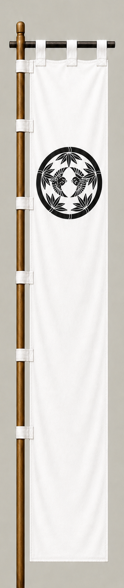

# Uesugi Kagekatsu

[日本語版](../../../commanders/western/uesugi-kagekatsu.md)

{ .wiki-image width="25%" }

Unit banner

## In-Game Data

| Attribute | Value |
|---|---:|
| Army | Western Army |
| Category | Additional commander for the fictional expanded map |
| Troops | 16,000 |
| Starting morale | 104 |
| Attack | 80 |
| Defense | 86 |
| Aggressiveness | 68 |
| Loyalty | 88 |
| Hesitation | 22 |
| Leadership | 86 |
| Command confidence | 84 |

## In-Game Characteristics

This is a large unit, with particularly high loyalty (88) and defense (86). Starting morale is 104, while hesitation is 22.

!!! note
    These are fixed values used outside the random-ability scenario. In-game statistics are not intended as a direct historical judgment of the individual.

## Brief Career

The adopted son and successor of Uesugi Kenshin. One of the Five Elders, his conflict with Tokugawa Ieyasu helped trigger the political crisis that led to Sekigahara.

## Character and Reputation

Tradition portrays him as quiet, dignified, and resolute. Together with Naoe Kanetsugu, he preserved the Uesugi house after defeat.

## History and Game Representation

Historical background and in-game statistics are presented separately. Character descriptions summarize common historical interpretations rather than offering definitive personality diagnoses.
