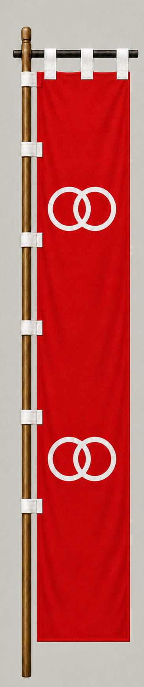

# Wakizaka Yasuharu

[日本語版](../../../commanders/western/wakizaka-yasuharu.md)

{ .wiki-image }

Unit banner

## In-Game Data

| Attribute | Value |
|---|---:|
| Army | Western Army |
| Category | Core Sekigahara commander |
| Troops | 1,000 |
| Starting morale | 90 |
| Attack | 58 |
| Defense | 54 |
| Aggressiveness | 34 |
| Loyalty | 40 |
| Hesitation | 74 |
| Leadership | 52 |
| Command confidence | 38 |

## In-Game Characteristics

This is a small unit, with particularly high attack (58) and defense (54). Starting morale is 90, while hesitation is 74.

!!! note
    These are fixed values used outside the random-ability scenario. In-game statistics are not intended as a direct historical judgment of the individual.

## Brief Career

One of the Seven Spears of Shizugatake. Although initially positioned with the Western Army, he changed sides during Sekigahara and attacked the Western right wing.

## Character and Reputation

A flexible survivor of political change, with experience in naval warfare and the Korean campaigns.

## History and Game Representation

Historical background and in-game statistics are presented separately. Character descriptions summarize common historical interpretations rather than offering definitive personality diagnoses.
