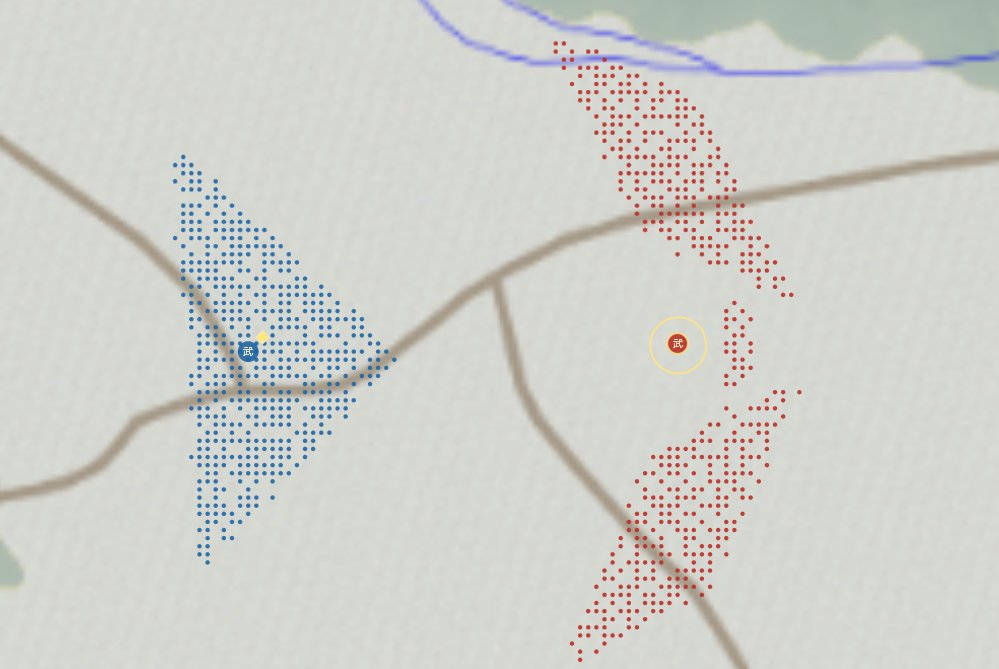

# Formation Overview

[日本語版](../../formations/index.md)

According to the experiments, the formations have the following characteristics.

{ .wiki-image }

The five available formations

| Formation | Characteristics after the introduction of matchlocks | Recommended use | Weaknesses |
|---|---|---|---|
| Square | Its dense shape is easy to defend, and guards for Matchlock Ashigaru also remain concentrated. | Hold the center and fight steadily from the front with around 30% matchlocks. Absorb the enemy charge, then counterattack enemy Matchlock Ashigaru with spears and cavalry. | Allied troops can easily block lines of fire. At high matchlock ratios, congestion in the front ranks reduces firing opportunities for the rear ranks. |
| Flexible Square | A balanced formation with more flexibility than Square in both lines of fire and troop movement. | Around 30–45% matchlocks. Spread according to the battle line while preserving allied lines of fire and retaining guards. | Its pressure on both wings and encirclement ability are not as strong as Crane Wing. At 60% matchlocks, the density of spear and cavalry guards is likely to become insufficient. |
| Crane Wing | Makes it easy to deploy Matchlock Ashigaru on both wings and create multiple lines of fire from the sides. As the formation envelops the enemy, pressure from the flanks and rear also increases. | Best suited to a high matchlock ratio. Keep spear and cavalry guards in the center, wear down the enemy with matchlocks on both wings, then envelop them. | If enemy spears or cavalry reach the wings first, the lower-durability Matchlock Ashigaru can collapse quickly. When there is a large difference in troop strength, it is better not to spread the wings too widely. |
| Deep | Its front-to-back depth is strong for breakthroughs and frontal pressure, but rear-rank matchlocks are easily blocked by the front ranks. | Keep the matchlock ratio low and mix them through the front and rear ranks. Put spears and cavalry forward and use them to quickly break enemy Matchlock Ashigaru with charges. | It does not work well with a high matchlock ratio. Lines of fire become congested while advancing, and it is vulnerable to flanking fire from Crane Wing and Fish Scale. |
| Fish Scale | Combines forward offensive pressure with lateral spread, making matchlock lines of fire relatively easy to create. | Suited to medium-to-high matchlock ratios. Pressure enemy Matchlock Ashigaru with spears and cavalry at the front, while supporting them with matchlocks from behind and the flanks. | Vulnerable to Crane Wing's broad encirclement and fire from both wings. If the front stops advancing, Matchlock Ashigaru can lose useful firing positions. |

## Practical Use

- **Around 30% matchlocks:** Flexible Square and Fish Scale are easy to use. Close combat by Spear Ashigaru and cavalry remains the main force, with matchlocks in a supporting role.
- **45–60% matchlocks:** Crane Wing is a strong choice. It creates broad lines of fire while concentrating the remaining spears and cavalry on guarding the matchlocks and charging enemy Matchlock Ashigaru.
- **Over 60% matchlocks:** Firepower is high, but guards are easily depleted. Even with Crane Wing, the formation is fragile if shooting cannot break the enemy before they close in.
