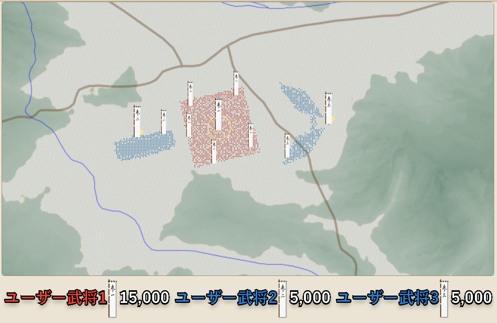

# 挟撃実験

[English version](../en/formations/pincer-experiment.md)

{ .wiki-image }

挟撃実験の配置。左のユーザー武将2部隊と中央のユーザー武将1部隊が戦い、右のユーザー武将3部隊が背後から中央の部隊を攻撃する。

各陣形を挟撃時に使用した場合の違いを確認するため、合計**118試行**の挟撃実験を行いました。

集計では、挟撃側の西軍10,000人を**正面5,000人・背面5,000人**に分け、中央の東軍10,000人または15,000人を攻撃しています。

以下の「交換効率」は、**東軍損害 ÷ 西軍損害**です。数値が高いほど、西軍側に有利な損害交換を示します。

## 実験全体の概要

| 東軍兵力 | 試行数 | 東軍勝利 | 西軍勝利 |
|---:|---:|---:|---:|
| 10,000 | 38 | 0 | 38 |
| 15,000 | 80 | 80 | 0 |

最も強く表れたのは兵力差でした。

- 同数の10,000対10,000では、西軍の挟撃側が全勝
- 東軍が15,000人になると、東軍が全勝
- 陣形や鉄砲足軽比率によって損害量は大きく変化したものの、今回の条件では勝敗を逆転させた条件はなかった

## 東軍10,000人：正面を方形自由30%で固定

正面部隊を**方形自由・鉄砲足軽30%・5,000人**で固定し、背面5,000人の陣形と鉄砲足軽比率を変更しました。東軍は全38試行で10,000人を失っています。

| 背面部隊 | 試行数 | 平均西軍損害 | 交換効率 |
|---|---:|---:|---:|
| 鶴翼 45% | 9 | 6,803 | **1.470** |
| 縦深 45% | 5 | 6,886 | 1.452 |
| 方形自由 45% | 4 | 7,083 | 1.412 |
| 魚鱗 45% | 4 | 7,085 | 1.411 |
| 鶴翼 30% | 5 | 7,172 | 1.394 |
| 方形自由 30% | 6 | 7,622 | 1.312 |
| 縦深 30% | 5 | 7,938 | 1.260 |

同じ陣形では、背面部隊の鉄砲足軽45%が30%より西軍損害を抑えました。

- 鶴翼：45%は30%より369人少ない
- 方形自由：45%は30%より539人少ない
- 縦深：45%は30%より1,052人少ない

同数戦では、背面部隊の鉄砲足軽45%による生存性向上が一貫して表れました。

## 東軍15,000人：正面を方形自由30%で固定

| 背面部隊 | 試行数 | 平均東軍損害 | 平均西軍損害 | 交換効率 | 損害差 |
|---|---:|---:|---:|---:|---:|
| 鶴翼 45% | 5 | 7,154 | 7,668 | **0.933** | 514 |
| 縦深 45% | 5 | 7,156 | 7,816 | 0.916 | 660 |
| 魚鱗 45% | 5 | 6,988 | 7,650 | 0.913 | 662 |
| 鶴翼 60% | 5 | 6,154 | 6,758 | 0.911 | 604 |
| 縦深 30% | 5 | 7,604 | 8,358 | 0.910 | 754 |
| 方形自由 30% | 10 | 7,639 | 8,609 | 0.887 | 970 |
| 方形自由 45% | 5 | 5,990 | 7,664 | 0.782 | 1,674 |

この条件では、次の傾向が確認できました。

- 背面鶴翼45%は損害交換効率が最も高かった
- 背面縦深45%と魚鱗45%は近い平均性能だった
- 背面魚鱗45%は西軍損害のばらつきが特に小さかった
- 背面鶴翼60%は双方の損害を減らした
- 背面方形自由30%は東軍にも西軍にも大きな損害を出した
- 背面方形自由45%は西軍損害の割に東軍損害が少なかった

鶴翼の鉄砲足軽比率を45%から60%へ増やすと、西軍損害は平均910人減りましたが、東軍へ与える損害も平均1,000人減りました。

## 東軍15,000人：背面を鶴翼45%で固定

背面部隊を**鶴翼・鉄砲足軽45%・5,000人**で固定し、正面部隊の陣形と鉄砲足軽比率を変更しました。

| 正面部隊 | 試行数 | 平均東軍損害 | 平均西軍損害 | 交換効率 | 損害差 |
|---|---:|---:|---:|---:|---:|
| 縦深 30% | 5 | 8,296 | 8,508 | **0.975** | 212 |
| 方形自由 15% | 5 | 7,220 | 7,526 | 0.959 | 306 |
| 魚鱗 30% | 5 | 7,576 | 7,934 | 0.955 | 358 |
| 縦深 15% | 5 | 7,198 | 7,706 | 0.934 | 508 |
| 方形自由 30% | 5 | 7,154 | 7,668 | 0.933 | 514 |
| 縦深 45% | 5 | 6,342 | 7,438 | 0.853 | 1,096 |
| 魚鱗 15% | 5 | 6,056 | 7,346 | 0.824 | 1,290 |
| 鶴翼 45% | 5 | 6,618 | 8,126 | 0.814 | 1,508 |
| 方形自由 0% | 5 | 4,352 | 7,422 | 0.586 | 3,070 |

### 方形自由

| 鉄砲足軽比率 | 平均東軍損害 | 平均西軍損害 | 交換効率 |
|---:|---:|---:|---:|
| 0% | 4,352 | 7,422 | 0.586 |
| 15% | 7,220 | 7,526 | **0.959** |
| 30% | 7,154 | 7,668 | 0.933 |

0%から15%で性能が急激に改善しました。鉄砲足軽0%では、西軍損害が15%より104人少ないだけなのに、東軍へ与える損害は2,868人少なくなりました。

15%と30%は近い結果ですが、15%のほうが平均西軍損害と交換効率でわずかに上回りました。

### 縦深

| 鉄砲足軽比率 | 平均東軍損害 | 平均西軍損害 | 交換効率 |
|---:|---:|---:|---:|
| 15% | 7,198 | 7,706 | 0.934 |
| 30% | 8,296 | 8,508 | **0.975** |
| 45% | 6,342 | 7,438 | 0.853 |

15%から30%では、双方の損害が増えながら交換効率も改善しました。30%から45%では双方の損害が減り、東軍への損害が特に大きく低下しました。

結果は単調ではなく、30%で山型のピークを示しています。

### 魚鱗

| 鉄砲足軽比率 | 平均東軍損害 | 平均西軍損害 | 交換効率 |
|---:|---:|---:|---:|
| 15% | 6,056 | 7,346 | 0.824 |
| 30% | 7,576 | 7,934 | **0.955** |

30%では15%より東軍損害が平均1,520人増え、西軍損害は588人増えました。交換効率は大幅に改善しました。

ただし魚鱗30%は結果の変動が大きく、東軍損害は5,450～8,740でした。失敗した1戦を除いた4戦では、平均損害交換がほぼ1対1でした。

### 正面・背面とも鶴翼45%

平均結果は**東軍損害6,618、西軍損害8,126、交換効率0.814**でした。

正面方形自由30%＋背面鶴翼45%と比べると、

- 東軍損害が536人少ない
- 西軍損害が458人多い
- 損害差が514から1,508へ拡大

という結果でした。

正面と背面を同じ鶴翼45%にするより、**正面方形自由30%・背面鶴翼45%の非対称構成**のほうが損害交換で上回りました。

## 陣形ごとの観察結果

### 方形自由

正面配置では、鉄砲足軽0%で著しく性能が低下しました。15%と30%は近い性能で、15%のほうが西軍損害を抑えました。

### 縦深

正面縦深15%は結果のばらつきが小さく、30%では損害量と交換効率が上昇しました。45%では再び性能が低下しました。

### 魚鱗

正面魚鱗15%は東軍を十分に削れませんでしたが、30%では上位の交換効率になりました。一方で結果の変動も大きくなりました。

背面魚鱗45%は、平均性能では縦深45%に近く、西軍損害が安定していました。

### 鶴翼

背面鶴翼45%は、複数の正面陣形との組み合わせで高い交換効率を示しました。60%では双方の損害が減少しました。

正面と背面をともに鶴翼45%とした場合は、正面を方形自由または縦深にした場合より交換効率が低下しました。

## ばらつきの特徴

特に安定していた条件は次のとおりです。

- 正面縦深15%：東軍損害の標準偏差約193、西軍約144
- 背面魚鱗45%：西軍損害の標準偏差約91
- 正面方形自由0%：低性能だが結果自体は安定

変動が大きかった条件は次のとおりです。

- 正面魚鱗30%：東軍損害の標準偏差約1,166
- 正面縦深30%：東軍損害の標準偏差約767
- 正面方形自由30%＋背面方形自由30%：試行群間の差が大きい

## 総括

今回の挟撃実験では、次の点が確認されました。

- 勝敗は東軍兵力10,000と15,000の違いで完全に分かれた
- 同じ陣形でも鉄砲足軽比率によって性能は大きく変化した
- 鉄砲足軽比率と性能の関係は単調ではなかった
- 正面部隊では、敵を拘束する白兵兵と射撃火力の両方が必要だった
- 鉄砲足軽0%では白兵兵が増えても東軍への損害は大幅に低下した
- 鉄砲足軽45～60%では双方の損害が減る条件が多かった
- 正面と背面では、同じ陣形でも性能が異なった
- 損害交換で西軍が上回る試行があっても、東軍15,000人の勝利は変わらなかった
- 東軍15,000人に対する最高平均交換効率は0.975で、兵力差を消耗戦だけで覆す水準には達しなかった
