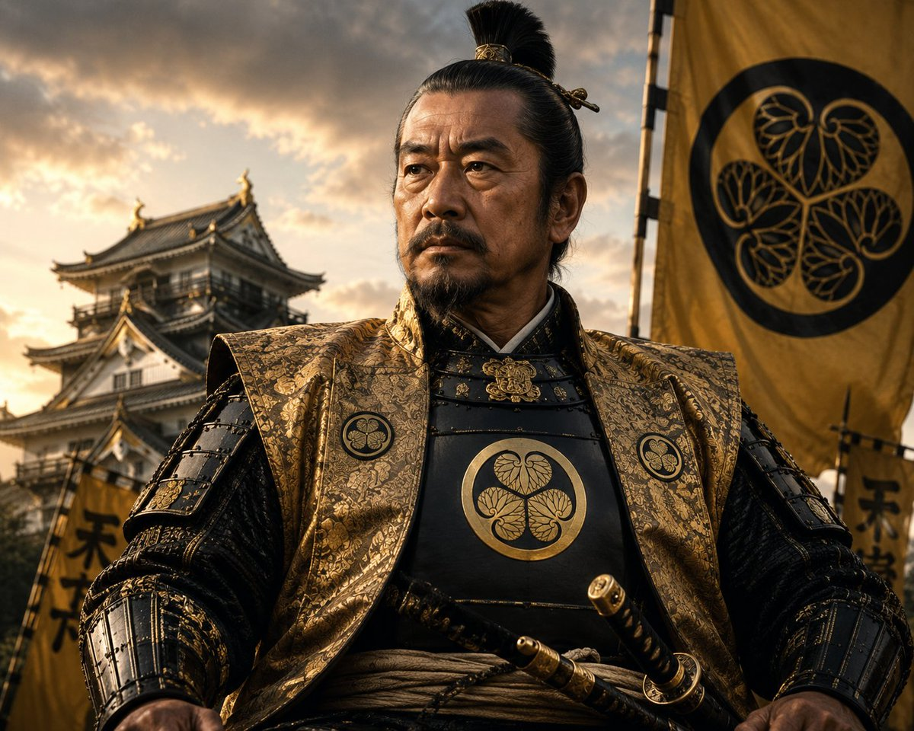
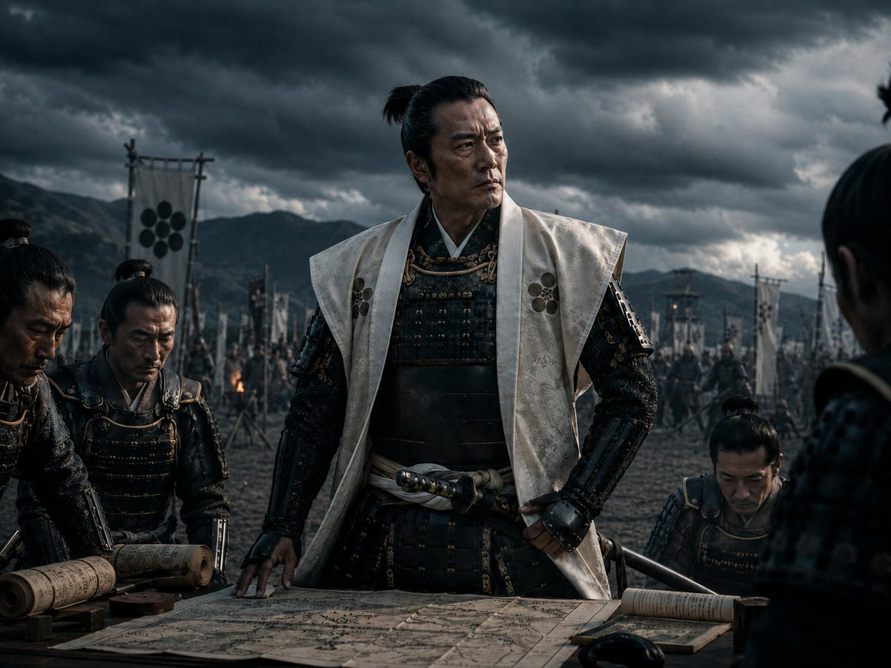
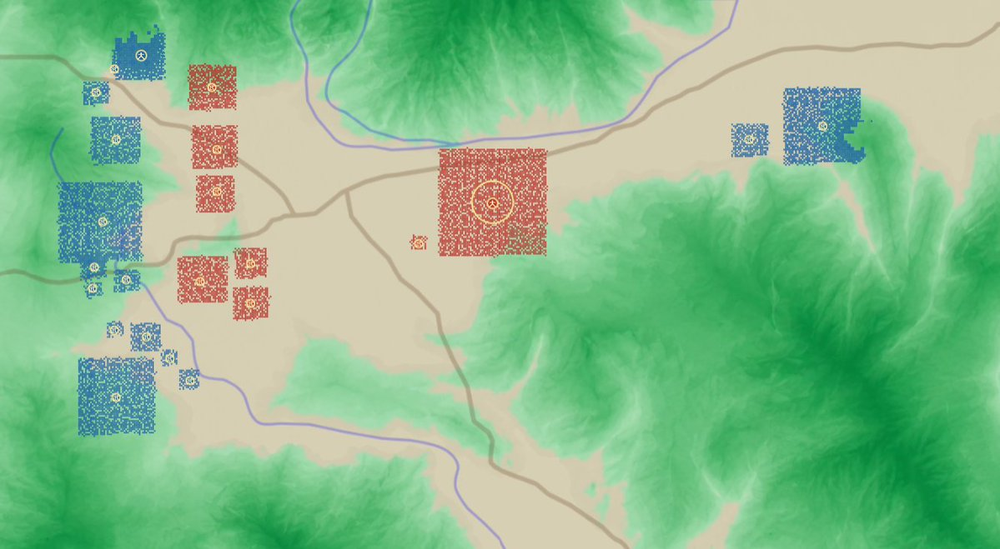
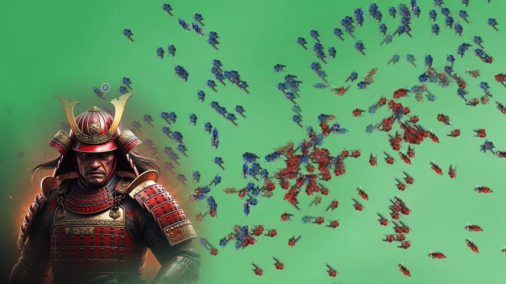
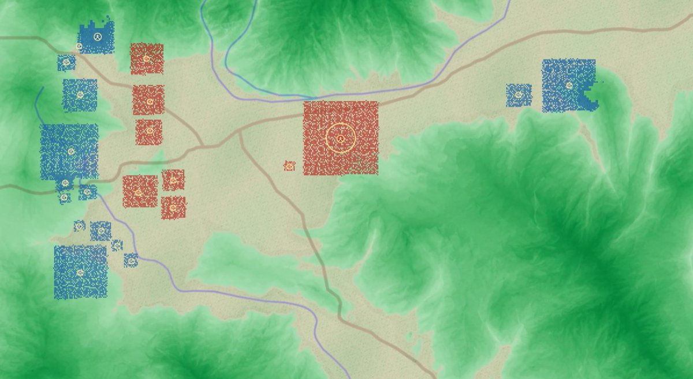
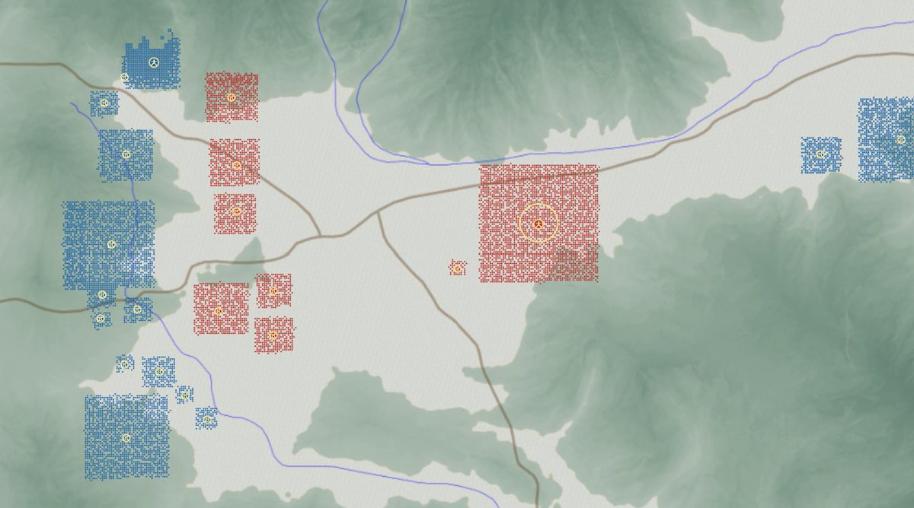

# 画像ギャラリー

このページでは、X投稿に添付されていた代表的な画像を、Wiki内で見やすい形に整理しています。

## 武将イメージ

{ .wiki-image }

徳川家康のイメージビジュアル

[元投稿を見る](https://x.com/IFHistorySim/status/2067918995349725605)

{ .wiki-image }

石田三成のイメージビジュアル

[元投稿を見る](https://x.com/IFHistorySim/status/2068478650102743371)

## Version 2.0.0

{ .wiki-image }

関ヶ原の地形をより忠実に再現した全体マップ

{ .wiki-image }

Ctrl＋左クリックの拡大モードで表示される兵士アニメーション

[元投稿を見る](https://x.com/IFHistorySim/status/2077689580266852834)

## Version 2.0.1

{ .wiki-image }

平野の色合いをより自然に調整したマップ

[元投稿を見る](https://x.com/IFHistorySim/status/2078020519312662880)

## Version 2.1.0

{ .wiki-image }

マップ全体の色合いをより落ち着いた印象へ変更

[元投稿を見る](https://x.com/IFHistorySim/status/2079023350177997266)

## Version 2.2.0

{ .wiki-image }

5種類の陣形が追加されたVersion 2.2.0の例

